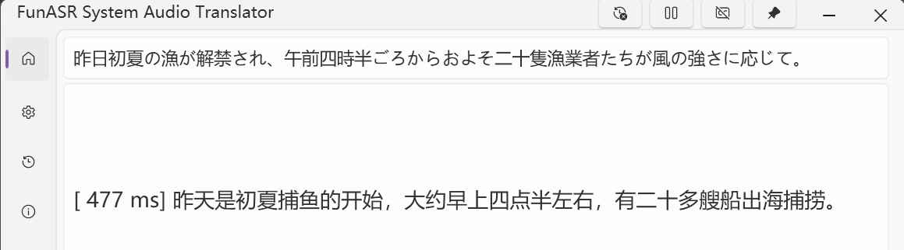
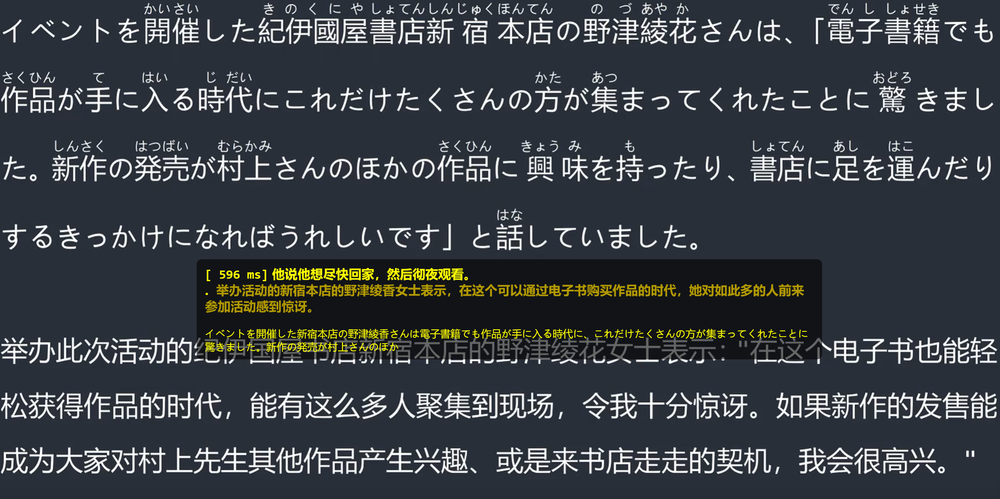
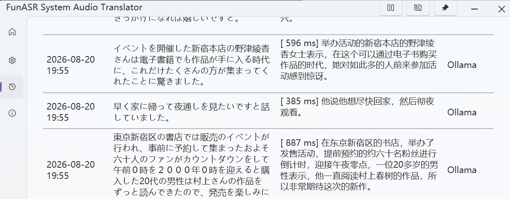
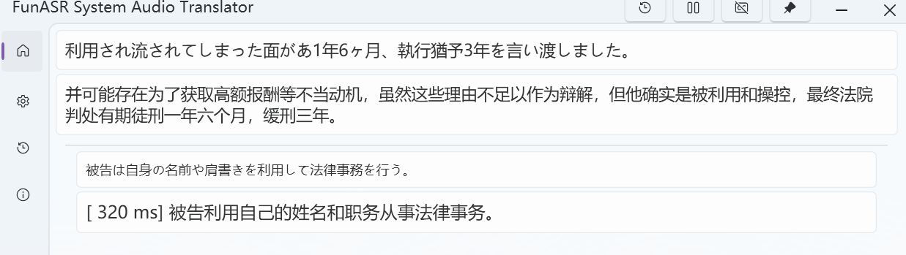
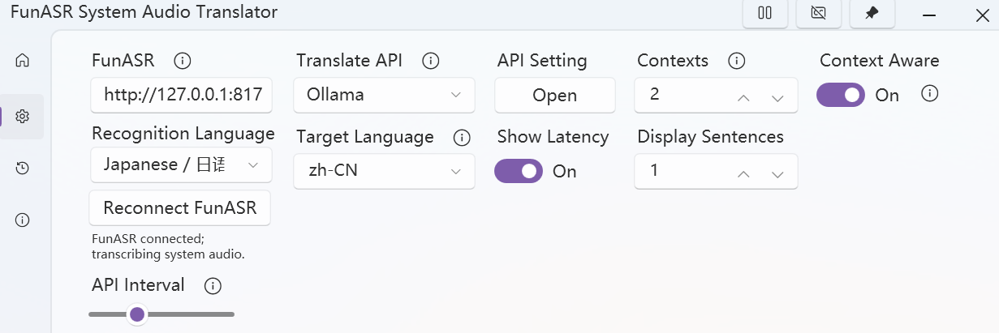



# FunASR System Audio Translator

> This fork replaces Windows LiveCaptions recognition with local Japanese or English FunASR recognition. Translation, context handling, overlay, and history continue to use the upstream pipeline.
>
> The application captures only the Windows default system output through WASAPI loopback. It does not capture a microphone or select an individual application. Either connect to an existing FunASR HTTP service exposing `/inference`, or configure the optional local auto-start path below. The default address is `http://127.0.0.1:8177` and can be changed on the settings page.

> The application can start a local FunASR service when its Python environment, server script, and model paths are configured through `FUN_ASR_PYTHON`, `FUN_ASR_SERVER`, `FUN_ASR_MODEL`, and `FUN_ASR_VAD_MODEL`. A runtime started by the application is terminated on normal application exit. Set `FUN_ASR_DEVICE=cpu` when CUDA is unavailable; the default is `cuda:0`.
>
> Recognition language can be switched between Japanese and English on the settings page without changing the target language or Ollama translation configuration.

### *Real-time system-audio caption and translation tool*

**English** | [中文](README_zh-CN.md)

## Overview

**✨ FunASR System Audio Translator = local FunASR speech recognition + translation API ✨**

This is a lightweight Windows tool that captures the default system output through WASAPI loopback, sends short audio windows to a local FunASR service, and translates the resulting captions.

The project keeps the upstream translation, overlay, and history workflow while replacing Windows LiveCaptions recognition with a locally hosted FunASR service. Recognition and translation therefore remain on the local machine when both services are configured locally.

**🚀 Quick Start:** Download a package from this repository's [Releases](../../releases), then follow the FunASR and Ollama setup instructions below. Model files and the Python runtime are intentionally not included in this repository.

For release builds, set `FUN_ASR_REPOSITORY_URL` to the repository URL to enable update checks. The legacy `LIVE_CAPTIONS_REPOSITORY_URL` variable is still accepted for compatibility. When neither variable is set, update checks remain disabled.

  
   
  <em style="font-size:80%">FunASR caption and translation window</em>
   

## Features

- **🔄 Local speech recognition**

  Captures the Windows default output through WASAPI loopback and sends short audio windows to a local FunASR service. No microphone is required.

  The source language can be selected in the application settings. The local service exposes `/health` and `/inference` endpoints.

- **🎨 Modern Interface**

  Easy-to-use and clean Fluent UI aligned with modern Windows aesthetics.

  It can automatically switches between light and dark themes 🌓 based on the system setting.

- **🌐 Local translation with Ollama**

  Uses only a local Ollama service. No caption text is sent to third-party translation providers by this application.

  

  | API                                  | Type      | Hosting     |
  |--------------------------------------|-----------|-------------|
  | [Ollama](https://ollama.com)         | LLM-based | Self-hosted |

  

  Ollama runs locally and supports incomplete captions and context-aware translation.

- **🪟 Overlay Window**

  Open a borderless, transparent overlay window to display subtitles, providing the most immersive experience. This is very useful for scenarios like gaming, videos, and live streams!

  You can even make it completely embedded into the screen, becoming part of it. This means it won't affect any of your operations at all! This is perfect for gamers.

  You can open the Overlay Window on the taskbar and adjust its parameters such as the window background and subtitle color, font size, and transparency. Extremely high configurability allows it to completely match your preferences!

  You can adjust the number of sentences displayed simultaneously in the *Overlay Sentences* section of the setting page.

  

    
     
    <em style="font-size:80%">FunASR overlay window</em>
     
  

- **⚙️ Flexible Controls**

  Supports Always-on-top window and convenient translation pause/resume, and you can copy text with a single click for quick share or saving.

- **📒 History Management**

  Records original and translated text, perfect for meetings, lectures, and important discussions.

  You can export all records as a CSV file.

  

    
     
    <em style="font-size:80%">FunASR translation history</em>
     
  

- **🎞️ Log Cards**

  Recent transcription records can be displayed as Log Cards, which helps you better grasp the context.

  You can enable it on the taskbar of the main page and change the number of cards in the *Log Cards* section of the setting page.

  

    
     
    <em style="font-size:80%">FunASR log cards</em>
     
  

## Prerequisites

| Requirement                                                                                                           | Details                                     |
|-----------------------------------------------------------------------------------------------------------------------|---------------------------------------------|
|  | Required for system-audio loopback capture. |
|              | Recommended. Not test in previous versions. |

This tool requires Windows 11 22H2 or later for system-audio loopback support. It does not use Windows LiveCaptions for speech recognition.

We suggest you have **.NET runtime 8.0** or higher installed. If you are not available to install one, you can download the ***with runtime*** version but its size is bigger.

  

    
  

## Getting Started

> ⚠️ **IMPORTANT:** You must complete the following steps before running FunASR System Audio Translator for the first time.
>
> The application captures the Windows default output device directly; no microphone or per-application audio selection is required.

### Step 1: Prepare FunASR

Install the FunASR server separately and download the required model files from their official repositories:

- ASR model: [FunAudioLLM/Fun-ASR-Nano-2512](https://huggingface.co/FunAudioLLM/Fun-ASR-Nano-2512)
- VAD model: [funasr/fsmn-vad](https://huggingface.co/funasr/fsmn-vad)
- FunASR project and server documentation: [modelscope/FunASR](https://github.com/modelscope/FunASR)

The model files are intentionally excluded from this repository. Keep them outside the Git working tree, or add any local model directory to `.gitignore`.

If you want the application to start a local FunASR service automatically, make the server script and models available and set:

- `FUN_ASR_PYTHON`: Python executable
- `FUN_ASR_SERVER`: `fun_asr_server.py`
- `FUN_ASR_MODEL`: complete `Fun-ASR-Nano-2512` model directory
- `FUN_ASR_VAD_MODEL`: FSMN-VAD model directory
- `FUN_ASR_DEVICE`: `cuda:0` or `cpu`

### Step 2: Configure the application

Start the application, open Settings, verify the FunASR server address, choose Japanese or English as the source language, choose a target language, and configure the local Ollama service. The default FunASR address is `http://127.0.0.1:8177`.

  
   
  <em style="font-size:80%">FunASR and Ollama settings</em>
   

After configuration, play audio through the Windows default output device to start captioning.

## Screenshots

The screenshots above were captured from the current local FunASR build after testing.

## Project Stats

### Activity

  
  
  
  

### Contributors

  
   
  <a href="../../graphs/contributors">
    Contributor statistics will be available after the repository is published.
  </a>

### Star History

Star history will be available after the repository is published.
